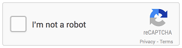
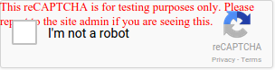

---

# This is the title of the article
title: CAPTCHA testų apėjimas
# Set author
author: M.Gzegozevskis
# Set writing time
time: 2021-10-01
# A page can only have one category
category: Testing
# A page can have multiple tags
tag:
- Selenium
- Testavimas
# this page is sticky in article list
sticky: true
# this page will appear in aricle channel in home page
star: true
# You can customize the footer
footer: MIT Licensed | Copyright © 2021-present M. Gzegozevskis
---

### CAPTCHA Testo apėjimo būdai :fire:

Turbūt šį paveikslėlį šiais laikais yra įprasta matyti visur. Todėl, kad CAPTCHA (Completely Automated Public Turing test to tell Computers and Humans Apart) testai yra skirti atskirti gyvą žmogų nuo kompiuterio.
Testuotojams tai yra galvos skausmas nes rašant automatinius testus mes tampame kompiuteriu :smile: arba kitaip tariant įgaliname kompiuterį atlikti užduotis.
Bloga praktika CAPTCHA testus apeiti naudojant automatinius testus, bet yra būdų kaip teisingai juos apeiti.



Taigi naudojant Selenium įrankį reikia užtikrinti sklandų testavimo darbą. Siūloma naudoti šiuos būdus:
::: info 1 būdas.
 Testuotojo aplinkoje atjungti Captcha testus, kai Captcha testas nėra reikalingas.
:::
Naudodami „Google“ atvirojo kodo „Captcha“ komponentą „reCAPTCHA v2“, kurio testinius raktus galite rasti adresu: [https://developers.google.com/recaptcha/docs/faq](https://developers.google.com/recaptcha/docs/faq)
Vadovaujantis tolimesnėmis instrukcijomis pateiktoje nuorodoje rasite papildomą paaiškinimą pagal Captcha testo versiją. 

```
Site key: 6LeIxAcTAAAAAJcZVRqyHh71UMIEGNQ_MXjiZKhI
Secret key: 6LeIxAcTAAAAAGG-vFI1TnRWxMZNFuojJ4WifJWe
```

Su testiniais raktais jums bus pažymėtą, kad jūs naudojate testinį Captcha testą.



::: info 2 būdas.
Apeiti naudojant Selenium Webdriver ir paspausti įprastą checkbox. 
:::

Pavyzdys kaip yra apeinama naudojant Chrome driver ir Captcha patalpintą testą. 
Taip pat jeigu matome yra naudojamas Webdriver wait kuris iš esmės yra dirbtinis sustabdymas. 
Taigi jeigu Captcha testas tampa komplikuotu rekomenduojama naudoti 3 būdą. Kur yra pusiau rankinis būdas.
```java 
public static void main(String[] args) { 

System.setProperty("webdriver.chrome.driver", "C:\\Utility\\BrowserDrivers\\chromedriver.exe"); 

ChromeOptions options = new ChromeOptions();

options.addArguments("start-maximized");

options.addArguments("disable-infobars");

options.addArguments("--disable-extensions"); 

WebDriver driver = new ChromeDriver(options);

driver.get("https://rsps100.com/vote/760"); 

new WebDriverWait(driver, 10).until(ExpectedConditions.frameToBeAvailableAndSwitchToIt(By.xpath("//iframe[starts-with(@name, 'a-') and starts-with(@src, 'https://www.google.com/recaptcha')]"))); 

new WebDriverWait(driver, 20).until(ExpectedConditions.elementToBeClickable(By.cssSelector("div.recaptcha-checkbox-checkmark"))).click(); 

}

```

::: info 3 būdas.
Dirbtinis Webdriver pristabdymas ir kol yra laukiama atliekamas rankinis (angl. manually) Captcha testo išsprendimas, paleisto testo metu.
:::

