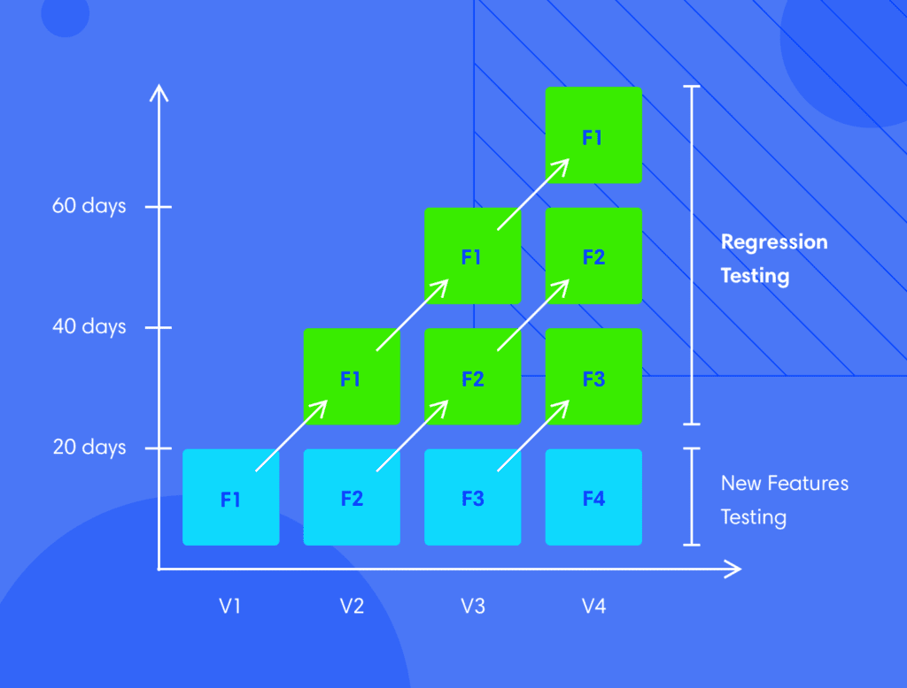

---
# This is the title of the article
title: Atgalinio ryšio testai
# Set author
author: M.Gzegozevskis
# Set writing time
time: 2021-10-01
# A page can only have one category
category: Testing
# A page can have multiple tags
tag:
- Selenium
- Testavimas
# this page is sticky in article list
sticky: true
# this page will appear in aricle channel in home page
star: true
# You can customize the footer
footer: MIT Licensed | Copyright © 2021-present M. Gzegozevskis
---

## Kas yra atgalinio ryšio (Regression) testavimas?  

Atgalinio ryšio testavimas yra tam tikras programinės įrangos kūrimo ciklo testavimo tipas, 
kuris atliekamas po kiekvieno programinės įrangos pakeitimo, siekiant užtikrinti, kad pakeitimas nesukeltų nenumatytų situacijų/problemų.

::: info
Šis testavimo būdas sprendžia bendrą problemą, su kuria susiduria kūrėjai - senų klaidų atsiradimui įvedus naujus programinės įrangos pakeitimus. 
Jei projekte nebus įdiegta griežta versijų kontrolės sistema, bus sunku atsekti, kuris pakeitimas sukėlė klaidą.
Todėl geroji praktika į bet kurį projektą įtraukti patikimą atgalinio ryšio testavimą.
:::
## Kaip aprašyti Regression Test Case?

Tarkime turime situaciją, kai testuotojas turi atlikti testą 
kaip yra pateikiama pirkinių krepšelio informacija antraštėje.
Tai QA (Kokybės užtikrintojas) turi atsakyti į šiuos klausimus:
- Ar skaičius krepšelyje įdėtų daiktų yra teisingai atvaizduojamas pagal 
dabartinį statusą? Tai nustatyti reikia patikrinti ar serveris 
gražina teisingą skaičių iš duomenų bazės ar local storage (duomenų saugykla našyklėje).
- Ar kintamasis, kuris saugo reikšmę apie krepšelyje esančius daiktus
teisingai perduotas DOM (Document Object Model) naršyklei? Reikia įsitikinti 
ar serveris informaciją perduoda į klientinę programą teisingai.
- Ar šis skaičius yra atvaizduojamas kai puslapis yra užkrautas.
- Ar šis elementas yra matomas kai slenkame žemyn? Ar šis elementas 
pasilieka viršuje jeigu yra nurodyta, kad jis bus prilipdytas prie viršaus (angl. sticky).
- Ar skaičius pasikeičia kai pridedame į krepšelį daugiau daiktų? 
- Ar teisingai susietas veiksmas įdėti į krepšelį su našyklėje esančiu DOM elementu
atsakingu už atvaizdavimą.
- Ar spalva yra ta pati to pačio tipo elemento? Ar tai buvo perrašyta kito elemento?
- Rašant testus visiems prieš tai apsvarstytiems scenarijams, 
būtina visapusiškai įvertinti visus kintamųjų ir elementų, susijusių su pirkinių krepšelio informacija, 
kuri yra atvaizduojama antraštėje aspektus.
::: info
  Svarbu prisiminti, kad regresijos testai tiek patikimi kiek gerai yra aprašyti testų atvejai (angl. test cases).
  Todėl, projektuojant testų atvejus, būtina skirti pakankamai laiko apmąstymams ir apsvarstyti kas gali nutikti su bet kuriuo elementu.
:::

## Kodėl atgalinio ryšio testai yra svarbūs?

Tipiškai tai nulemia testų rašymą jau žinomoms klaidoms (angl. bugs) ir paleisti kiekvieną kartą kai yra keičiamas programinis kodas.
Tai leidžia greitai identifikuoti ir aptikti klaidas, kuris pakeitimas sukėlė šią naują klaidą (angl. bug).
Dažnas programinio kodo atnaujinimas įvedą lankstumo jog kūrėjai/programuotojai nesugadintų jau esamo kodo veikimo įdėdami naujus pakeitimus.
Paleidus testus tiesiog greitai galima nustatyti ar kažkas sugadinta po pakeitimo.
Vizualiai galima atvaizduoti skaitant iš kairės į dešinę kur V1, V2, V3, V4 naują programos versiją.
Kiekvienam iš naujų versijų funkcionalumui yra aprašomi atgalinio ryšio Test Cases F1, F2, F3, F4. 
Kiekvieną kartą kai yra sukuriama nauja programos versija ir yra pridedamas naujas funkcionalumas yra patikrinami ankstesni Test Cases.
Pvz. turime programos versiją V3 tada bus atliekami F1 ir F2 Test Cases, bei naujasis aprašytas Test Case skirtas funkcionalumui F3.

## Challenges in Regression Testing

While regression testing may be integral to the quality assurance process, it comes with its fair share of challenges. Developers and decision-makers must consider the following before adopting it in their software development cycle.

Time and Cost Requirements
We have seen that regression testing is incremental — the number of tests changes with each new feature that is added. It involves running older tests with every change. Thus, these tests can take significant time to complete.

One way around this is to adopt parallel tests with newer changes. This lowers the time required to run the tests but may result in higher costs, thanks to added server resources or more people involved.

Complexity
When a project grows, not only does the number of tests increase but the complexity too. In the shopping cart example above, the testing of the cart is logically done only after creating a new user and browsing to a search page. Thus, the sequence of the tests into play too. With an increasing number of tests, the sequential aspect may lead to a branching out of tests that might become difficult to handle without additional testers.

Regular Maintenance
To manage the time and complexity of regression testing, one needs to make sure that proper maintenance is done. For example, if a design change mandates the movement of the shopping cart to the right menu — how does that affect the existing regression tests? Though the change may only involve minor changes to the front end, the tests would need to be redesigned completely.

## Best Practices for Regression Testing

Now that we have discussed the nuances of regression testing, let us look at some best practices that one must follow.

Implement a regression framework from the beginning of the project, with detailed test designs to ensure that no rework is needed at a future stage.
Regularly reassess developers’ and users’ needs and update test designs accordingly
Analyze the user experience on your web application to narrow down highly used functionalities to focus test designs on
Add new tests to the testing pack when new functionality is added to the application
Regression tests are almost always automated, and therefore testers must be experienced in writing test scripts for a variety of test cases. For example, regression testing can be done through Selenium and BrowserStack, where the method of defining the test remains the same – but the process of execution is through a browser on a real device. BrowserStack can thus facilitate quick, convenient automated testing on both desktop and mobile devices.

https://www.browserstack.com/guide/regression-testing
